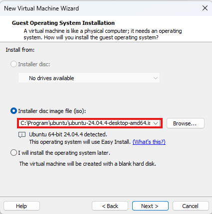
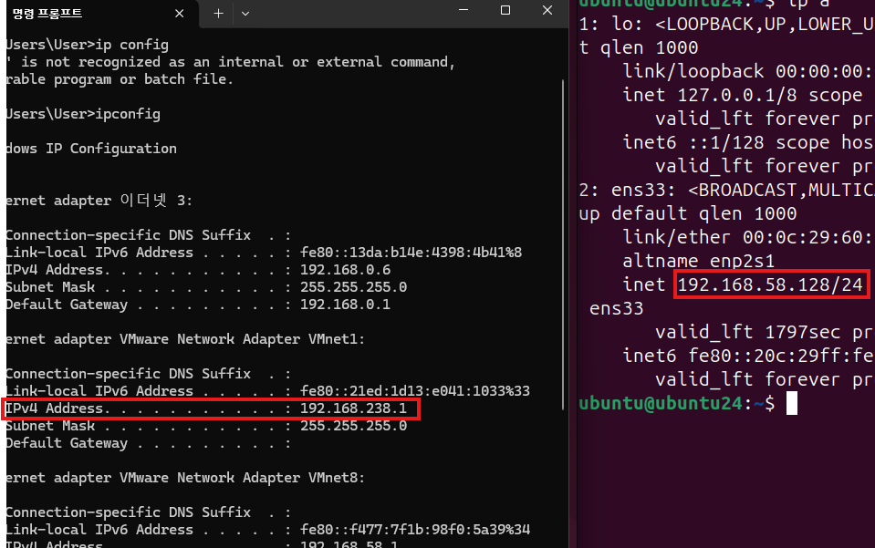
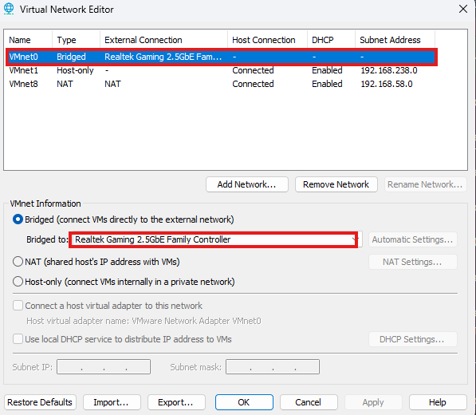
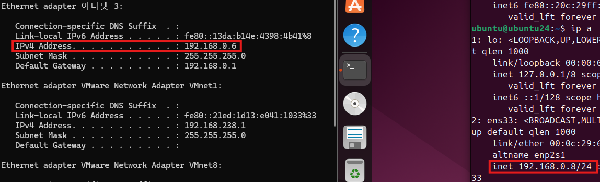

# 2026-TCP/IP Socket
2026 네트워크 소켓 학습

## 1일차
- 소켓 프로그래밍이란, 내 컴퓨터와 상대방 컴퓨터간의 통신

### VMWARE Workspace Pro 설치
- https://www.broadcom.com/
- https://all4null.tistory.com/75 블로그 참조
- 내 원래 컴퓨터 시스템을 건드리지 않고, 새로운 운영체제를 깔아서 마음껏 실험할 수 있음
- 서버용 가상 컴퓨터와 클라이언트용 가상 컴퓨터를 각각 띄워 실제 네트워크 환경처럼 테스트 가능
- 윈도우와의 별개의 IP주소를 할당가능

### Ubuntu 설치
- https://ubuntu.com/download
- VMWARE라는 빈 컴퓨터에 설치해서 사용하는 리눅스(Linux)기반의 운영체제

### Socket 통신
- **서버 기준**
    - `socket()` - 통신을 위한 엔드포인트(소켓)을 생성합니다. 운영체제로부터 소켓 리소스를 할당받는 단계 ex) **전화기 구입**
    - `bind()` - 생성한 소켓에 IP주소와 포트번호를 부여,어느 포트로 들어올지 결정하는 과정 ex) **전화번호 할당**
    - `listen()` - 클라이언트의 접속 요청을 받을 수 있는 '대기 상태'로 만듦, 연결 요청 대기 큐를 생성 ex) **개통(전화 대기)**
    - `accenpt()` - 실제로 클라이언트의 연결 요청이 왔을 때 이를 승인, 이때 통신을 위한 새로운 소켓이 생성되어 실제 데이터 통로가 열림 ex) **전화 받기**
    - `read(),write()` - 연결된 상대방과 데이터를 주고 받기 ex) **통화**
    - `close()` - 통신이 끝난 후 소켓을 닫고 리소스를 반납합니다. ex) **통화 종료**

### VMWAWRE 사용
- create vitrual
- 
    - 네모칸에 설치한 우분투 삽입
    - 설치

- 리눅스 명령어
    - pwd : 현재 위치
    - ~ : 사용자 디렉토리
    - / : 관리자 디렉토리
    - cd : change directory > cd, cd / 
    - ls : 디렉토리 확인 옵션: -a(숨겨진 파일), -l(자세히), -la
    - clear: 화면 지우기
    - ip a : ip확인
    - mkdir : 새로운 디렉토리 생성
    - rm : 삭제 
    - rm -fr : 삭제 명령(폴더도 함께 삭제)
    - chmod : 권한설정
    - 컴파일 : gcc 파일명.c -o 실행파일이름
    

- 리눅스 ip설정
- edit > vitrual network editor > change setting

## 2일차

### 프로토콜
- `약속`
- 연결지향형 소켓(TCP)
    - 중간에 데이터 소멸되지 않는다.
    - 전송 순서대로 데이터가 수신된다.
    - 데이터의 경계가 존재하지 않는다.
    - 소켓 대 소켓의 연결은 반드시 1대1 구조
- 비연결지향형 소켓(UDP)
    - 전송순서 상관없이 빠른 속도의 전송을 지향
    - 데이터 손실 및 파손의 우려 있다.
    - 데이터의 경계가 존재한다.
    - 한번에 전송할 수 있는 데이터의 크기가 제한된다.

